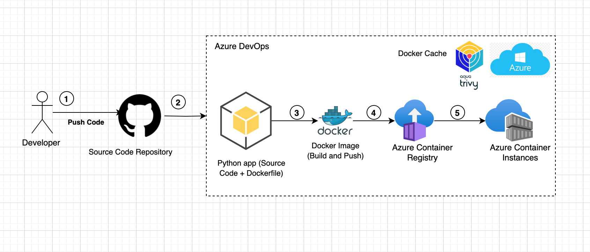

# Build and Deploy Dockerized Python Application to Azure Container Instances (ACI) using Azure DevOps

This project demonstrates how to build a Dockerized Python application and deploy it to **Azure Container Instances (ACI)** using an automated **Azure DevOps CI/CD pipeline**.

---

## 🚀 Overview

This pipeline performs the following steps:

- ✅ Triggers automatically when changes are pushed to the `main` branch.
- ⚙️ Checks for and creates an Azure Resource Group (if it doesn't exist).
- 🗂 Creates or verifies an existing Azure Container Registry (ACR) with admin access.
- 🐳 Builds a Docker image using BuildKit and caches layers for faster builds.
- 🔍 Scans the Docker image for vulnerabilities using **Trivy**.
- 📤 Pushes the tagged and latest Docker images to ACR.
- 📦 Deploys the Docker container to **Azure Container Instances (ACI)**.
- 🔁 Verifies deployment status and container state.

---

## 📁 Azure DevOps Pipeline




---

## 🛠 Requirements

- Azure DevOps project
- Azure Subscription with permissions to create ACR, ACI, and Resource Groups
- Azure CLI installed (for local testing)
- Docker installed (for local builds)
- Trivy (optional, for local vulnerability scanning)

---

## 🐳 Dockerfile

A simple `Dockerfile` example for a Python app:

```dockerfile
FROM python:3.10-slim

WORKDIR /app

COPY requirements.txt .
RUN pip install --no-cache-dir -r requirements.txt

COPY . .

CMD ["python", "app.py"]
